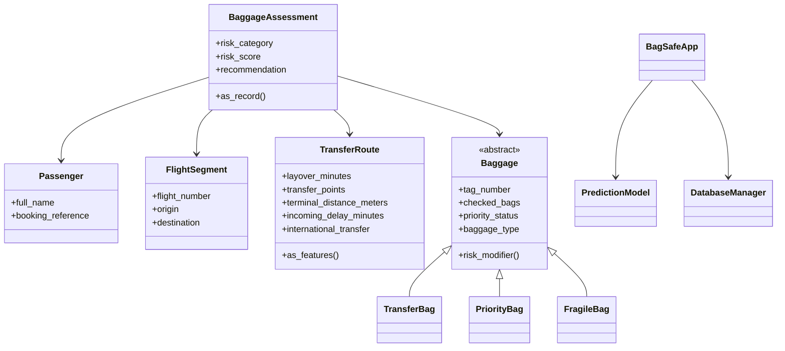

# Software Development Document (SDD)

## 1. System Purpose

BagSafe AI helps airline and airport staff identify baggage that is likely to miss a transfer between connecting flights. The system combines data entry, prediction, and record management in one desktop application.

## 2. Functional Requirements

- Users can enter baggage transfer details through a GUI form.
- Users can generate a baggage transfer risk prediction.
- Users can save predicted assessments to an SQLite database.
- Users can search saved records by passenger, booking reference, bag tag, flight number, or risk category.
- Users can delete selected records.

## 3. Non-Functional Requirements

- The system must run on a standard computer with Python installed.
- The interface must be simple enough for operational staff to use with minimal training.
- The code must remain modular and maintainable.
- The application must handle invalid input without crashing.

## 4. CLO Alignment

- `CLO 1`: OOP is demonstrated through classes such as `Passenger`, `FlightSegment`, `TransferRoute`, and `BaggageAssessment`.
- `CLO 2`: Inheritance and overriding are shown through `TransferBag`, `PriorityBag`, and `FragileBag`, each implementing `risk_modifier()`.
- `CLO 3`: Abstraction and encapsulation appear in the abstract `Baggage` base class and the separation between GUI, database, and ML layers.
- `CLO 6`: Tkinter provides the GUI for data entry, prediction, record viewing, and search.

## 5. High-Level Design

## 6. GUI Design Considerations

- The form groups operational input fields in one place to reduce entry time.
- The prediction summary is visually separated from the data-entry section so staff can identify the result quickly.
- The records table supports follow-up monitoring and reflects stored history.
- Validation protects against blank or invalid numeric values.

